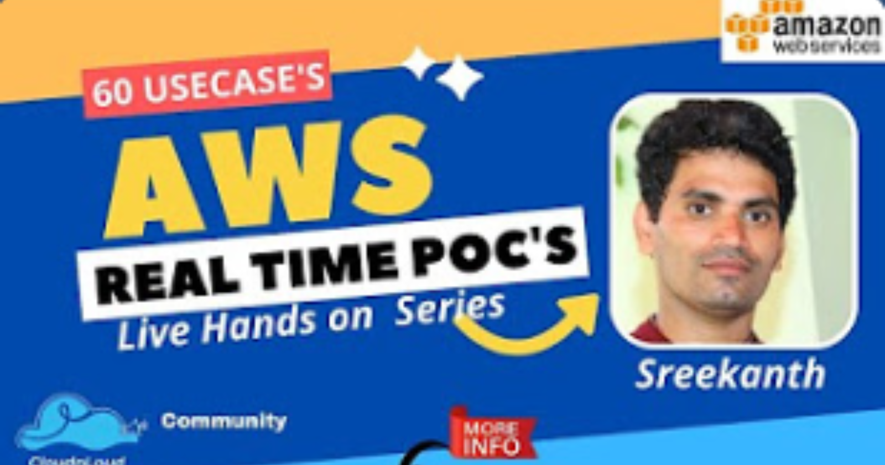
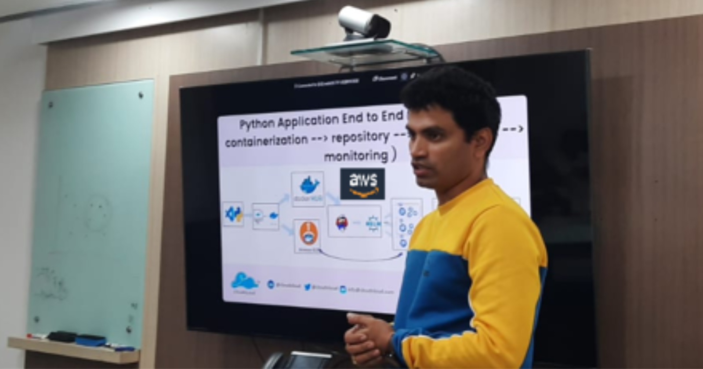
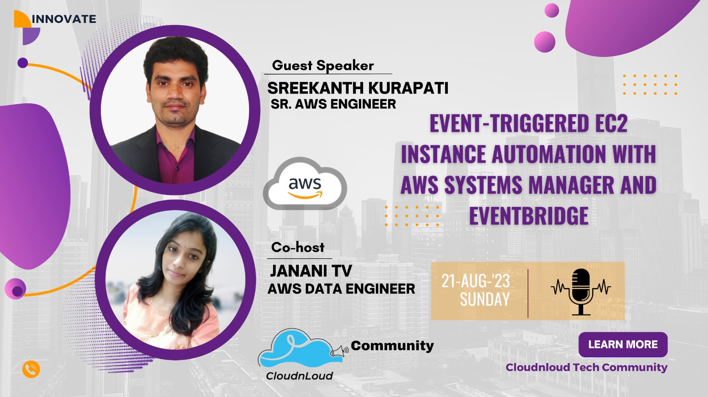
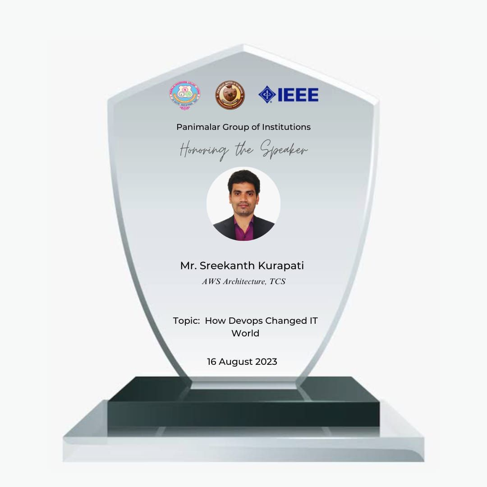
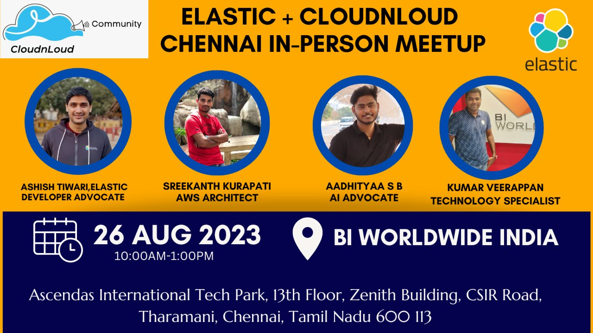

<!--
**Sreekanthkurapati/sree1786** is a ✨ _special_ ✨ repository because its `README.md` (this file) appears on your GitHub profile.

Here are some ideas to get you started:

- 🔭 I’m currently working on ...
- 🌱 I’m currently learning ...
- 👯 I’m looking to collaborate on ...
- 🤔 I’m looking for help with ...
- 💬 Ask me about ...
- 📫 How to reach me: ...
- 😄 Pronouns: ...
- ⚡ Fun fact: ...
-->

## Hi 👋

I'm **[Sreekanth Kurapati](https://www.linkedin.com/in/sreestack/)** ; You can call me - **Sreekanth**. .

Having 13 years of professional experience in IT with Masters education (MCA). 

Working as Technical Architect / Transformation Manager - Cloud & DevOps. Helping customers with Implementation & Cloud Migration - Fintech. 

Having domain experience in Financial Services, automotive electronics, Healthcare,  Industrial, Public Sector engagements & Stock Exchange.

I always love to learn - Unlearn - Relearn, Motivated to Share knowledge with peers, community and learn from them.

I have 10+ Technical Certification in AWS, Azure,  CKA/CKAD, Terraform Certified

## 𝐓ECHNICAL SKILLS

•	Cloud (AWS, Google Cloud, Microsoft Azure), Automation & DevOps, CI/CD  
•	Python, Terraform, Ansible  
•	Citrix – XenApp & XenDesktop, VMWare, HyperV, Windows, Active Directory, SCCM, SCOM  
•	Atlassian tools (JIRA, Confluence), ServiceNow and Remedy  
•      Agile Service Delivery, Stakeholder Management, ITSM, Project Management  

## TECHNICAL CONTRIBUTION

## 𝐀𝐖𝐒𝐃𝐞𝐯𝐨𝐩𝐬𝐄𝐧𝐠𝐢𝐧𝐞𝐞𝐫

- AWS Codecommit, AWS Code pipeline, AWS Code Build, AWS Code Deploy, AWS EC2-Imagebuilder, AWS Code Artifact, AWS Code Guru, AWS Amplify(https://medium.com/cloudnloud/aws-devops-engineer-day1-1278bb218165)

- 

## AWS - Usecase Blogs 

- [AWS Cloud Services - Food ordering process (SNS,SQS,DynamoDB,S3,Python)](https://medium.com/cloudnloud/usecase-1-sns-sqs-dynamodb-s3-python-db479ba6aecc)
- [AWS Cloud Services - Different types of deploymenty (S3,Code Commit, Code Pipeline,Lambda,Fargate,security group, Loadbalacer ELB,VPC)](https://medium.com/cloudnloud/usecase-7-deployment-types-hot-deployment-rolling-deployment-blue-green-deployment-31d697b296a2)
- [AWS Cloud Services - Pipeline Deployment(AWS codecommit, AWS codedeploy and Ec2 ) ](https://medium.com/cloudnloud/usecase-6-integration-aws-codecommit-aws-codedeploy-and-ec2-53c0bfd8f553)
  
- [AWS Cloud Services - AWS Security (AWS Security group)](https://medium.com/cloudnloud/security-group-maintain-in-aws-using-of-python-2fb16ee5903f)
- [AWS Cloud Services - Install Cloudwatch unified agent on EC2 ( AWS Cloud watch, Ec2)](https://medium.com/cloudnloud/install-cloudwatch-unified-agent-on-ec2-instance-and-gather-the-logs-a9094c1ff57a)

- [AWS Marketplace category and how does it work (AWS AMI,EC2)](https://medium.com/cloudnloud/what-is-aws-marketplace-category-and-how-does-it-work-7e3c0ff8b22)
- [AWS Adding additional EBS volume to EC2 instance ( AWS EBS, EC2) ](https://medium.com/cloudnloud/adding-additional-ebs-volume-to-ec2-instance-a394d7d80a3a)
- 𝐇𝐨𝐰 𝐭𝐨 𝐜𝐫𝐞𝐚𝐭𝐞 AWS 𝐄𝐂𝟐 𝐢𝐧𝐬𝐭𝐚𝐧𝐜𝐞 ( 𝐌𝐮𝐭𝐢𝐩𝐥𝐞 𝐰𝐚𝐲𝐬 𝐭𝐨 𝐜𝐫𝐞𝐚𝐭𝐞 𝐀𝐖𝐒 𝐄𝐂𝟐 )
  
  	I.  [How to create EC2 instance with CLI( Command Line interface )](https://medium.com/cloudnloud/how-to-create-ec2-instance-with-cli-command-line-interface-bd8c2a7f716d)
  
  	II.  [𝐇𝐨𝐰 𝐭𝐨 𝐜𝐫𝐞𝐚𝐭𝐞 𝐄𝐂𝟐 𝐢𝐧𝐬𝐭𝐚𝐧𝐜𝐞 𝐰𝐢𝐭𝐡 𝐩𝐲𝐭𝐡𝐨𝐧 𝐬𝐜𝐫𝐢𝐩𝐭](https://medium.com/cloudnloud/-dffc39124da2)
  
  	III. [How to create an EC2 instance from golden image](https://medium.com/cloudnloud/how-to-create-an-ec2-instance-from-golden-image-d372da1e242a)

   	IV.  [How to create EC2 Instance using cloudformation](https://medium.com/cloudnloud/how-to-create-ec2-instance-using-cloudformation-1463a792878c)

  	V.  [How to create EC2 Instance using Terraform ](https://medium.com/cloudnloud/how-to-create-ec2-instance-using-terraform-77a19b8edea7)

  	VI.  [𝐂𝐫𝐞𝐚𝐭𝐞 𝐚 𝐬𝐢𝐦𝐩𝐥𝐞 𝐋𝐢𝐧𝐮𝐱 𝐄𝐂𝟐 𝐢𝐧𝐬𝐭𝐚𝐧𝐜𝐞](https://medium.com/cloudnloud/-67754b4e6592)

  	VII.  [Configure and Launch a simple Linux EC2 instance](https://medium.com/@sreekanthkurapati/configure-and-launch-a-simple-linux-ec2-instance-2d6bb74c6c61)

## AWS USECASE- Video links

- [AWS Cloud Services - USECASE-1  (SNS,SQS,DynamoDB,S3,Python)](https://youtu.be/odKhlh8TkTE) (part1)
- [AWS Cloud Services - USECASE-1  (SNS,SQS,DynamoDB,S3,Python)](https://youtu.be/1Myp7UxxhI4) (part2)
- [AWS Cloud Services - USECASE-2 (AWS codecommit, AWS codedeploy and Ec2 )](https://youtu.be/86Y8rp6xjtA )
- [AWS Cloud Services - USECASE-3 (S3,Code Commit, Code Pipeline,Lambda,Fargate,security group, Loadbalacer ELB,VPC )](https://youtu.be/Zrw-8NETiW8)
- [AWS Cloud Services - 𝐓𝐲𝐩𝐞𝐬 𝐨𝐟 𝐃𝐞𝐩𝐥𝐨𝐲𝐦𝐞𝐧𝐭𝐬 (EC2,Loadbalncer, security group, Autoscaling ,code deploy,code pipeline,Target groups,Deployment )](https://youtu.be/Zrw-8NETiW8) 

 

- [AWS DevOps & Opensource Devops along with Log monitoring tools( Physical meetup )](http://bitly.ws/KdGB) 

# AWS POC's playlist / Shared all trainings / session materials here at YouTube for community members.

- https://www.youtube.com/playlist?list=PLh_VNk4-EHTP-6U2jR05pYgpOcPgJDE5N

## 𝐂𝐍𝐂𝐅

𝐜𝐥𝐨𝐮𝐝𝐜𝐚𝐬𝐚  --> https://www.linkedin.com/posts/sreestack_secure-your-eks-workloads-step-by-step-guide-activity-7095983059136622592-Jn-q?utm_source=share&utm_medium=member_desktop

𝐈𝐬𝐭𝐢𝐨 𝐒𝐞𝐫𝐯𝐢𝐜𝐞 𝐌𝐞𝐬𝐡 --> https://www.linkedin.com/posts/sreestack_istio-servicemesh-step-by-step-activity-7087328633010208770-Bgve?utm_source=share&utm_medium=member_desktop

𝐇𝐞𝐥𝐦  --> https://www.linkedin.com/posts/sreestack_helm-installation-and-best-practices-activity-7085603644775010304-cirB?utm_source=share&utm_medium=member_desktop

𝐀𝐫𝐠𝐨𝐂𝐃 --> https://www.linkedin.com/posts/sreestack_argocd-basics-and-installation-activity-7083805167065722880-d47f?utm_source=share&utm_medium=member_desktop

## 𝐌𝐞𝐞𝐭𝐮𝐩'𝐬

https://www.linkedin.com/posts/sreestack_elasticsearch-cloudnloud-meetup-activity-7068115482171625472-fn8_?utm_source=share&utm_medium=member_desktop

https://www.linkedin.com/posts/sreestack_cloudnloud-learing-leadership-activity-7097946695585439744-Os3r?utm_source=share&utm_medium=member_desktop

https://www.linkedin.com/posts/sreestack_cloudnloud-gratitude-learing-activity-7070815429509738497-NoU5?utm_source=share&utm_medium=member_desktop

https://www.linkedin.com/posts/sreestack_elastic-cloudnloud-tech-in-person-meetup-activity-7100825255190962176-Fas6?utm_source=share&utm_medium=member_desktop

## 𝐕𝐎𝐋𝐔𝐍𝐓𝐄𝐄𝐑𝐈𝐍𝐆

## ROLE: # 𝐂𝐨𝐦𝐦𝐮𝐧𝐢𝐭𝐲 𝐀𝐦𝐛𝐚𝐬𝐬𝐚𝐝𝐨𝐫

I am part of 𝐂𝐥𝐨𝐮𝐝𝐧𝐋𝐨𝐮𝐝 𝐓𝐞𝐜𝐡 𝐂𝐨𝐦𝐦𝐮𝐧𝐢𝐭𝐲 Core team.

The CloudnLoud Tech Community is a non-profit open source tech community, volunteer-run events presenting by members of the CloudnLoud Community.

The goal of our community is to bring together companies, leaders and professionals from around the world to share ideas, socialize and work together on advancing the present and future success of the project. We are part of this for good cause to save millions of Cancer children.

At CloudnLoud Tech community, we are organizing free tech conferences, technical trainings and technical discussions on various IT technologies & open source tools.

## Github Stats  

  

 

## Connect with me  

 

<!--
 
 
  
  
	

-->

<!--

 
  Visitor count 
  

           
  -->    
  

<!-- hitwebcounter Code START              

   

    -->    

<!-- 

  

  --> 
